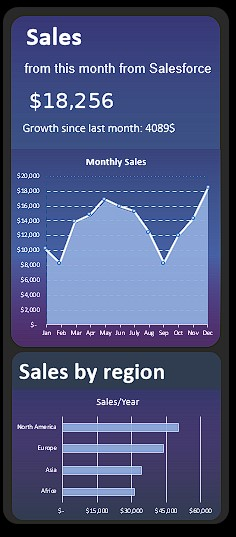

We are going to start building this beautiful dashboard, I followed the guide on LinkedIn from Joshua Cottrell-Schloemer a Performance dashboard specialist.
### Final look at the dashboard:

I really liked the design and how clean the dashboard looked. So I decided to build a similar one and adding a few tweaks and a personal touch.

1. (CTRL + a) and fill with black color
2. Insert → shape → rounded rectangle
3. right click on rectangle and format shape and choose fill (white color) and turn transparency to 84%
4. Line → No line
5. copy rectangle to two smaller rectangles inside the big one
6. select the top rectangle and select gradient fill (I chose purple and blue) because they look nice.
Transparency → 43%
7. select bottom triangle and fill it with blue only (transparency → 75%)
8. Insert → Text → Text box, Make it Transparent by making it no fill. 
9. For the sales number, we can connect it to any cell value we want by using the formula bar. We are going it to connect to sales this month.
10. As for the sales increase this month, It will be difference in sales cell this month minus the sales last month, thus giving us the revenue.
11. We can insert a rectangle that is fully transparent from one side and mostly transparent on the other. Just a divider to the chart part, that we are going to place in the display.
12. We are going to insert a line area chart.
Settings will be for the background:
Gradient Fill
No line
For the chart:
Fill with a light blue and 4% transparency

13. Copy the chart and from design → choose line with markers chart.
14. Delete everything but the line itself from the char and place on top of the original chart to make it look even better.
15. We are going to use sales data from each region and add it to the sales by region section in the bottom of our dashboard.
16. Insert → Clustered bar chart, It will be formatted the same way as the previous chart, just to make everything look cohesive.
17. And That's It!. A beautiful, clean dashboard that is pleasing to the eyes and with great insights to a data analyst about sales growth about each region.

And That's It!. I hope that you liked my project, and thank you so much for reading through till the end. If you need to ask me about anything related to the steps of creating this project or anything else :). Just feel free to contact me on my Email: Eng.Sameh.Abdelmoaty@Gmail.com

And I hope that you have a wonderful day.